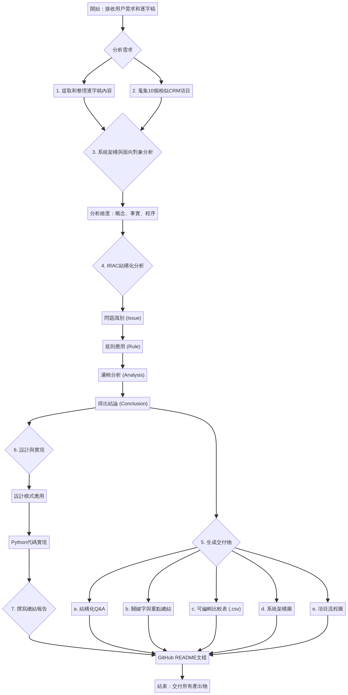
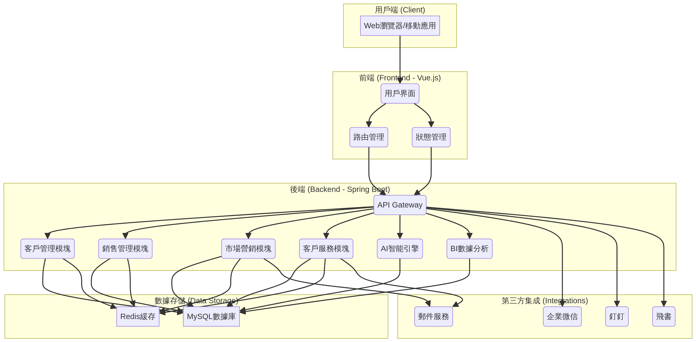

# CRM 項目開發深度分析報告

本報告旨在對一個CRM（客戶關係管理）系統的開發教學案例進行全面、多維度的分析。我們從一份語音教學的逐字稿入手，深入探討其技術實現、架構設計和業務邏輯，並橫向對比了10個業界主流的開源CRM項目，最終提供了一套完整的分析、設計與代碼實現。

## 1. 項目背景

項目源於一份關於CRM系統開發的教學逐字稿，其中詳細描述了一個典型CRM功能（如銷售機會的添加與更新）的實現過程。我們的任務是基於這份材料，進行逆向工程分析，並將其擴展為一個完整的、可執行的項目案例。

## 2. 分析流程

我們採用了系統化的分析流程，以確保分析的深度和廣度。詳細流程如下圖所示：



## 3. 核心分析內容

### 3.1 逐字稿內容精煉

我們首先對逐字稿進行了結構化整理，提煉出其核心技術點和業務邏輯。

- **核心功能**：通過一個共用的對話框（Dialog）實現銷售機會的“添加”與“更新”。
- **關鍵技術**：利用隱藏域（Hidden Field）存儲記錄ID，並在前端通過`jQuery`判斷ID是否存在，以決定調用`POST`（添加）還是`PUT`（更新）的`API`接口。
- **架構模式**：體現了典型的前後端分離思想。

### 3.2 行業項目對比

我們蒐集並分析了包括 `SuiteCRM`, `Vtiger CRM`, `Cordys CRM` 在內的10個開源CRM項目。

- **技術趨勢**：技術棧正從傳統的 `PHP + jQuery` 向現代的 `Java/Spring Boot + Vue.js` 演進。
- **功能趨勢**：`AI`（人工智能）和`BI`（商業智能）的集成成為新一代CRM的核心競爭力。
- **部署趨勢**：`Docker` 容器化部署正成為主流，以簡化部署和提高可移植性。

完整的比較數據請參見 [可編輯比較表](05_comparison_table.csv)。

### 3.3 系統架構設計

基於分析，我們設計了一個現代化的CRM系統架構，如下圖所示：



該架構採用了前後端分離模式，後端基於微服務思想進行模塊化設計，並集成了AI和BI引擎，數據層則採用MySQL和Redis組合，以兼顧數據持久化和高性能緩存。

### 3.4 IRAC 結構化分析

我們運用`IRAC`（Issue, Rule, Analysis, Conclusion）框架，對項目中的核心技術挑戰進行了法律邏輯般的嚴謹分析。

- **Issue (問題)**: 如何在同一UI中處理不同操作？如何在獨立頁面間傳遞數據？
- **Rule (規則)**: 應用了`RESTful` API設計原則、前端開發規範和業務邏輯規則。
- **Analysis (分析)**: 深入剖析了使用隱藏域傳遞ID的利弊，並探討了更安全的替代方案。
- **Conclusion (結論)**: 確認了教學案例中方案的可行性，並提出了在數據驗證、錯誤處理和安全性方面的改進建議。

詳細報告請參見 [IRAC分析報告](04_irac_analysis.md)。

## 4. 關鍵字與Q&A

為了便於快速理解和查閱，我們整理了項目的關鍵字和結構化Q&A。

- [關鍵字與重點總結](07_keywords_summary.md)
- [結構化Q&A表格](06_qa_table.md)

## 5. 設計模式與代碼實現

在下一階段，我們將基於以上分析，應用多種設計模式（如工廠模式、策略模式、觀察者模式等）對系統架構進行重構，並提供完整的Python代碼實現。

### 設計模式應用

- **工廠模式 (Factory Pattern)**: 用於根據不同請求創建不同的操作對象（如添加操作、更新操作）。
- **策略模式 (Strategy Pattern)**: 用於實現不同的銷售人員指派算法，可以根據不同場景動態切換策略。
- **觀察者模式 (Observer Pattern)**: 用於實現事件驅動機制，例如，當一個銷售機會被更新時，自動通知所有相關的觀察者（如項目經理、銷售總監）。

### Python 項目結構 (預覽)

```
/crm_project
|-- /app
|   |-- /api          # API 接口模塊
|   |-- /services     # 業務邏輯服務
|   |-- /models       # 數據庫模型
|   |-- /utils        # 工具類
|   |-- __init__.py
|   |-- config.py     # 配置文件
|-- /tests            # 測試用例
|-- main.py           # 應用程序入口
|-- requirements.txt  # 依賴列表
|-- README.md
```

## 6. 項目改進與未來方向

1.  **增強AI能力**: 引入更複雜的機器學習模型，用於銷售預測、客戶流失預警和智能推薦。
2.  **深化BI集成**: 提供更靈活的自定義報表和多維度數據鑽取功能。
3.  **移動端優化**: 開發原生的移動應用，提供更佳的移動辦公體驗。
4.  **安全性強化**: 引入更全面的安全措施，如OAuth 2.0認證、API網關等。

---

本README文檔將隨著項目的進展持續更新。
